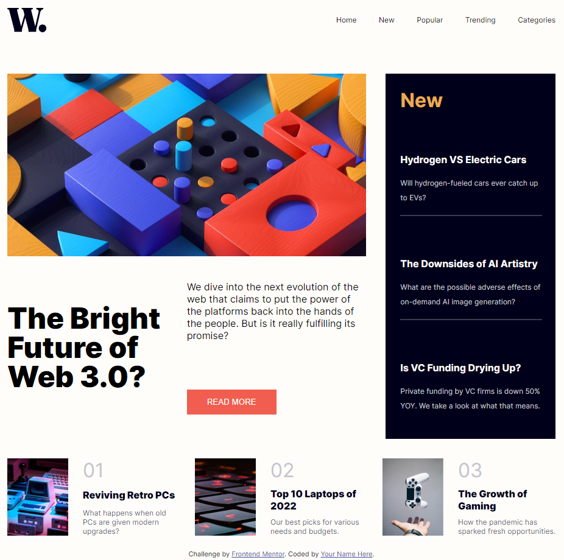

# Frontend Mentor - News homepage solution

This is a solution to the [News homepage challenge on Frontend Mentor](https://www.frontendmentor.io/challenges/news-homepage-H6SWTa1MFl). Frontend Mentor challenges help you improve your coding skills by building realistic projects. 

## Table of contents

- [Overview](#overview)
  - [The challenge](#the-challenge)
  - [Screenshot](#screenshot)
  - [Links](#links)
- [My process](#my-process)
  - [Built with](#built-with)
  - [What I learned](#what-i-learned)
  - [Continued development](#continued-development)
- [Author](#author)

**Note: Delete this note and update the table of contents based on what sections you keep.**

## Overview

### The challenge

Users should be able to:

- View the optimal layout for the interface depending on their device's screen size
- See hover and focus states for all interactive elements on the page

### Screenshot

### Links

- Solution URL: [GitHub Repo](https://github.com/Klaudia-Czerska/news-homepage-main)
- Live Site URL: [Page](https://klaudia-czerska.github.io/news-homepage-main/)

## My process

### Built with

- Semantic HTML5 markup
- CSS custom properties
- CSS Grid

### What I learned

I finally learned the power of CSS Grid, it is a great tool! Earlier I tried to use Flex everywhere, and it really is not for everything.

### Continued development

I want to continue improving my CSS skills. Next I want to learn using preprocessors.

## Author

- Frontend Mentor - [@Klaudia-Czerska](https://www.frontendmentor.io/profile/Klaudia-Czerska)

